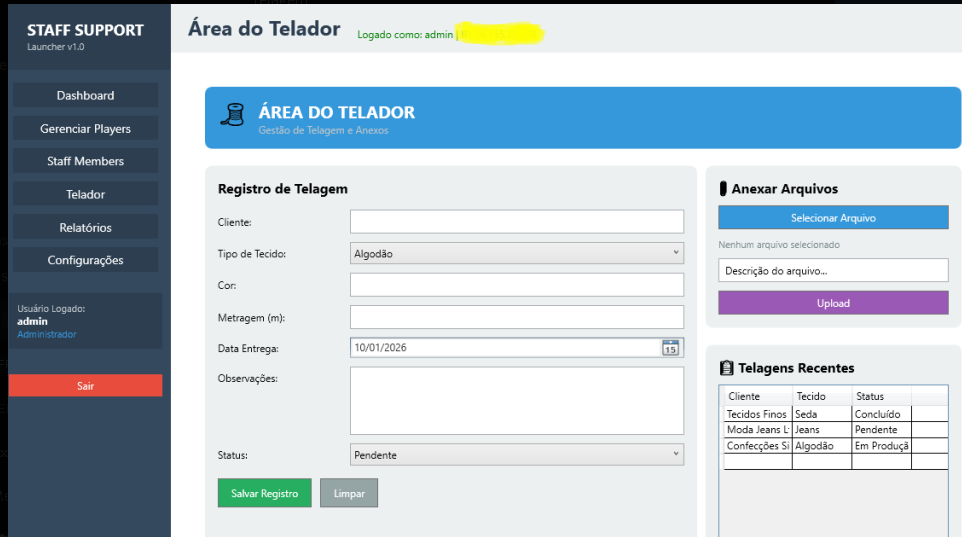

# 🧑‍💼 Painel RH – Minecraft (Equipe Staff)
**Versão 1.0 – Aplicativo em C#**

O **Painel RH** é um aplicativo desenvolvido em **C# (WPF)** com o objetivo de gerenciar e controlar o acesso da **equipe Staff de servidores Minecraft**, oferecendo **segurança por liberação de IP**.

---

## 📌 Funcionalidades

- 🔐 Controle de acesso por **IP autorizado**
- 🧑‍💼 Focado em **gestão de equipe Staff**
- ⚙️ Configuração simples via código
- 💻 Aplicação desktop em **C# (.NET / WPF)**

---

## 🖼️ Interface do Aplicativo



> A imagem acima representa a interface principal do aplicativo.

---

## 🔐 Sistema de Segurança por IP

O acesso ao painel é liberado **somente para endereços IP previamente autorizados** no código-fonte.

### 📍 Onde configurar o IP

Abra o arquivo:MainWindow.xaml.cs

Na **linha 21**, localize o seguinte trecho de código:

```csharp
private readonly string[] ALLOWED_IPS = new string[]
{
    "seu ip",
    "",
    ""
};

Como configurar corretamente

Descubra seu IP local (IPv4):

Abra o Prompt de Comando (CMD)

Execute:

ipconfig


Copie o valor de Endereço IPv4

Substitua "seu ip" pelo seu IPv4, exemplo:

private readonly string[] ALLOWED_IPS = new string[]
{
    "192.168.0.15",
    "192.168.0.20"
};


⚠️ Apenas os IPs listados terão acesso ao sistema.

Tecnologias Utilizadas

💠 C#

💠 .NET (WPF)

💠 XAML

💠 Visual Studio


--------------------------------

Instalação e Uso

Clone o repositório:

git clone https://github.com/Joaoigor789/PAINEL-RH.git


Abra o projeto no Visual Studio

Configure os IPs permitidos no arquivo:

MainWindow.xaml.cs

------------------------------------------

Compile e execute o projeto

Observações Importantes

Pastas como bin/ e obj/ não fazem parte do repositório

Arquivos .rar ou builds devem ser distribuídos via GitHub Releases

Este repositório contém apenas o código-fonte

----------------------------------------------

Autor

João Igor Rodrigues Pereira da Silva
Fundador da HostingDevPro

=========================================

📄 Licença

Este projeto é de uso privado/educacional.
Adapte conforme sua necessidade.


Se quiser, posso:
- Ajustar o README para **inglês**
- Melhorar a parte de **segurança**
- Criar uma seção de **Releases**
- Padronizar para **portfólio profissional**

É só falar 🚀

=========================================


